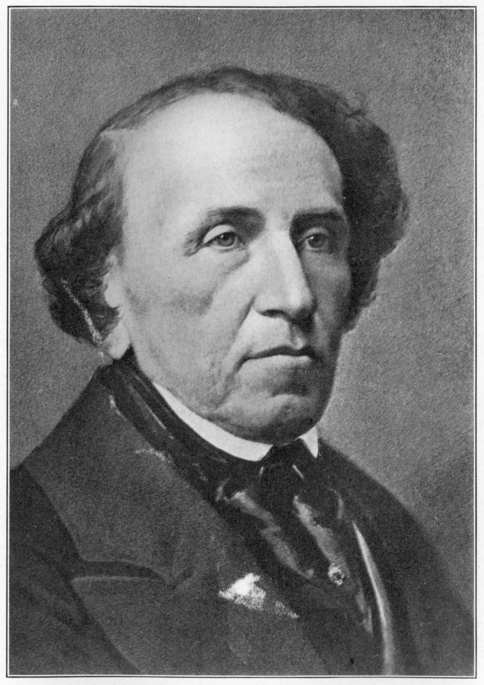
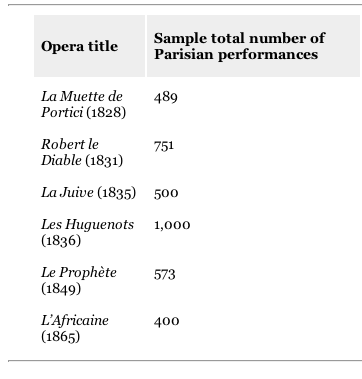
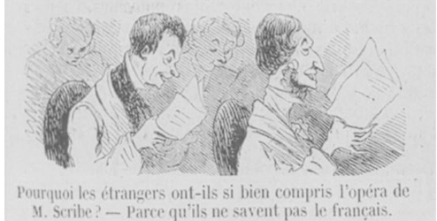

==============================
Grand Opera
==============================

Defining Grand Opera
============================

.. class:: incremental

- Very broad term

- Might be thought of as both "magnificent" and "big"
 

Defining Grand Opera
============================

"A grand opéra is a nineteenth-century French type...[containing] a 
serious, often tragic subject of an epic or historical nature, 
the use of the chorus in action, the inclusion of a ballet, at 
least one spectacular scene with elaborate writing for the solo 
and choral voices in concert and (normally) division into five acts..." 

(*Grove's Dictionary*, 1954 edition.)

Defining Grand Opera
============================

.. class:: incremental

- "nothing exceeds the luxury of the grand opera, which has now become a paradise for the hard of hearing." -Heinrich Heine

- "effects without causes" - Wagner on Meyerbeer

Abbate and Parker's Definition
====================================

To merit the name *grand opéra*, you had to concoct something large-scale, serious, French,
and almost always in five acts. 

History of a monumental brand furnished plot material, often the history of religious conflict: Jews or Muslims
against Christians perhaps, or Protestants against Catholics.

Abbate and Parker's Definition (continued)
===============================================

While tragic opera often involved clashing tribes of some kind, librettists writing for the Opéra
defined those tribes as whole nations or faiths, not just Montagues and Capulets. 

Abbate and Parker's Definition (continued)
===============================================

You needed a long ballet, one that you were obliged, 
often with desperate ingenuity to weave into the plot.

Abbate and Parker's Definition (continued)
===============================================

Charlemagne (or some other grand historical personage) broods 
on the eve of an important battle? In that case,
what could be more fitting than the sudden appearance of 
a troupe of ballerinas, impersonating 
nearby gypsies, to beguile his melancholy with dance?

Abbate and Parker's Definition (continued)
===============================================

You also had to deploy large choral forces in several acts. 
Your libretto would be set in a decently remote
historical period, ideally the Middle Ages or a little later.

(pp.264-265)

Grand Opera in Paris
========================

.. class:: incremental

- The middle of the nineteenth century in Paris created an "operatic microclimate that had never occurred before and allowed *grand opéra to emerge.*" (Parker and Abbate, 2012)

- State subsidies that were unprecedented at the time.

- The bill for Meyerbeer's *Les Huguenots* came to over 100,000 francs just for the scenery, costumes, and props.

- The entire budget for a typical *directeur-entrepreneur* was about 600,000 francs per year.

Grand Opera in Paris
========================

.. class:: incremental

This money went to create an event in which the scenery, 
the orchestral splendor, and the vocal virtuosity
were all unprecedented.

Grand Opera in Paris
========================

An American tourist wrote in 1838:

"They call this French opera, the 'Académie Royale 
de Musique',...the Grand Opera'; this latter name because 
it has a greater quantity of thunder and lightning, of 
pasteboard seas, of paper snow storms, and dragons that spit 
fire; also a gorgeousness of wardrobe and scenery not equalled 
upon any theatre of Europe. It is certain its 
'corps de ballet' can outdance all the world put together. 
Mercy! How deficient we are in out country in these elegant 
accomplishments." (cited in Abbate and Parker 2012; p.264)

Financial Support
========================

.. class:: incremental

- Legal foundations for the Opera were laid down by Napoleon.

- In 1806, he decreed that all theatrical activity would be placed under state control, and in 1807 the Opera, Comedie-Francaise, Opera-Comique, and the Theatre de l'Imperatrice (which would later be the Theatre Italien, where Rossini worked) were all designated 'grand theatres.' 

Financial Support
========================

.. class:: incremental

- Regulations defined what type of genre and entertainment were permitted at each institution.

- In 1864, Napoleon III announced that the theatre industry was no longer under such restrictions: 'any individual may build or run a theatre'

Restoration (1815-1830)
============================

.. class:: incremental

- Under the Restoration, the opera's budget was increased about 40% (1.2 million francs to 1.78 million francs)

Department of Fine Arts Report (1829)
==========================================

"the sustained success of Rossini's works, of our male and female singers who have been trained on good
[i.e. Italian] principles, the ever-increasing size of audiences, are clear proof that the musical revolution...
carried out by maestro Rossini was timely and urgent..."

(cited in *Cambridge Companion to Grand Opera, Ch.2*)

Giacomo Meyerbeer (1791-1864)
==================================

Giacomo Meyerbeer (1791-1864)
==================================

	

Of the six most performed operas in Paris in the 19th-century, four of them
(*Robert le Diable*, *Les Huguenots*, *Le Prophete*, and *L'Africaine*) were 
written by Meyerbeer.

Giacomo Meyerbeer (1791-1864)
==================================

.. class:: incremental

- Born in Tasdorf, near Berlin.

- Apprenticed in Germany, before moving to Italy (where he became heavily influenced by Rossini and his followers).

- Composed a number of Italian operas, but his last (*The Crusade in Egypt* in 1824) finds him already breaking free of the Rossinian style in favor of increased complexity.

- Moved to paris in the late 1820s, where he stayed until his death in 1864.

Italian Influence
=======================

Rossini's influence was strong in Paris, who settled there in 1824.

"Italian scores have greatly influenced us;
we are no longer happy with well-declaimed phrases and a few 
expressive arias – we want *morceaux d'ensemble*, *finales*, and so on."
(Rodolphe Kreutzer writing in 1824)

Italian Influence
=======================

Rossini was brought to Paris to run the *Theatre Italien*, and to 
impose the Italian style of singing and voice-production on French Opera.

*Robert le Diable* (1831)
==============================

"inaugurated a new, eminently French genre that fused Rossinian *bel 
canto* with Beethovenian symphonism."

*Robert le Diable* (1831) Synopsis (Act 1)
================================================

.. class:: incremental

- Robert is a knight about to enter a tournament to win Princess Isabelle's hand in marriage.

- As the opera opens, all of the knights are singing and partying.

- Raimbaut (Robert's servant) sings a ballad about a princess from Normandy who married the devil.

- Says that they had a son (Robert).

'Jadis regnait en Normandie' (There once reigned in Normandy)
====================================================================

Establishes plot background by describing a villain and his son (the opera's anti-hero, Robert)
and links the story to certain musical motifs.

Motifs recur not only to accompany the verbal allusions to the characters, but also to announce these 
characters appearance on stage.

This is an early example of what would come to be known as a *leitmotif,* "that all-important link between a musical 
fragment and a visual or verbal manifestation." (Abbate and Parker, 2012, p.273)

*Robert le Diable* (1831) Synopsis (Act 1)
================================================ 

.. class:: incremental

- After hearing this, Robert sentences Raimbaut to death, but backs down when he finds out that Raimbaut is engaged (and later finds out that it's to his half-sister).

- She (named Alice) arrives, and tells Robert that their mother has died.

- Alice warns Robert to beware of his friend, Bertram.

- Robert then gambles with the knights and loses his money and his suit of armor.

*Robert le Diable* (1831) Synopsis (Act 2)
================================================

.. class:: incremental

- Robert is given a new suit of armor by the princess (who loves him), and is preparing for the fight, but:

- Bertram arrives and convinces him to go to a nearby forest, claiming someone wants to fight him for Isabella's hand.

*Robert le Diable* (1831) Synopsis (Act 3)
================================================

.. class:: incremental

- In the countryside, Bertram reveals that Robert is his son.

- Alice comes to express her love for Raimbaut, when she hears strange noises coming from the cave.

*Robert le Diable* (1831) Synopsis (Act 3)
================================================

.. class:: incremental

- During all of this, Alice learns that if Bertram can't get Robert to sign away his soul by midnight, he will lose him forever.

- Bertram finds Alice, and threatens her unless she keeps quiet.

- Robert Arrives, and Bertram says that to win, he should use a branch with magical powers, but he must take it from a deserted convent nearby (which would be sacrilegious).

- Robert does so, and the ghosts of nuns rise from their graves and dance.

*Robert le Diable* (1831) Synopsis (Act 3)
================================================

"The obligatory third-act ballet is a counterpart to Weber's Wolf's Glen scene, the fiery 'Valse infernale' representing 
a demonic orgy in a deserted cave; most spectacularly, as well as most obviously indebted to the phantasmagoria shows, 
it includes a swirling dance for a whole convent-cemetery's worth of risen nuns' corpses. With its
dancing dead nuns this was clearly just as much an opera to see as to hear...made Meyerbeer the toast of Paris."

`Link <http://www.youtube.com/watch?feature=player_detailpage&v=i4k46ittWd0#t=176/>`_.

*Robert le Diable* (1831) Synopsis (Act 4)
================================================

.. class:: incremental

- In the palace, Isabelle is about to marry someone else.

- Robert arrives, and freezes everyone with the magic branch, except for Isabelle.

- He feels guilty, and confesses he's using witchcraft, but asks for forgiveness.

- She expresses her love and Robert breaks the branch and breaks the spell, but is arrested.

*Robert le Diable* (1831) Synopsis (Act 5)
================================================

.. class:: incremental

- Bertram frees Robert from the palace prison, and attempts to get him to sign the document.

- When he tells Robert he is his true father, Robert decides to sign the document. 

- Before he signs it, Alice comes in and shows him their mother's will, which says to beware of the man that seduced her and ruined her life.

- Midnight passes, and Bertram descends to Hell. Robert reunites with Isabelle.

`Finale <http://www.youtube.com/watch?v=sjDA97mENTo/>`_.

Impact
================================================

.. class:: incremental

- Wildly popular throughout Paris. 

- Gave Meyerbeer a reputation, and freedom to compose more elaborate operas and stagings.

- Reunited with librettist Eugene Scribe for *Les Huguenots* in 1836

Eugene Scribe and Grand Opera
================================================

Caption: "Why do foreigners understand Scribe's opera so Easily?– Because they don't know French!"

Eugene Scribe and Grand Opera (continued)
================================================

"Rather than imagining himself to be a solitary Romantic genius, alone in his ivory tower...
Scribe was willing and able to work with others in the very writing of librettos themselves, hence
the green-eyed jibe...'We shouldn't give him a chair but a bench!'" (*Cambridge Companion to Grand Opera*, Ch. 10)

He dedicated the collection of his complete works: "To my collaborators." 

*Les Huguenots* (1836)
====================================

.. class:: incremental

- Raoul (Protestant) and Valentine (Catholic), a pair of star-crossed lovers, are caught in the Reformations's web.

- They meet their doom in the course of the infamous St. Batholomew's Day massacre of 1572.

- The fifth act is entirely dedicated to the massacre. 

- The auditorium reeked of gunpowder and buckshot, adding yet another sensory element to the media saturation for which grand opera was famous.

- An indictment of religious fanaticism.

(RT)

*Les Huguenots* Act IV
====================================

.. class:: incremental

- Valentine hides Raoul from her fanatical father.

- Valentine then sings alone (the only solo soliloquy in the entire opera)

- `Duet once Valentine says that she loves Raoul <http://www.youtube.com/watch?feature=player_detailpage&v=KqneixPh0bc#t=192/>`_.

*Les Huguenots* Act V
====================================
 
- `The Massacre <http://www.youtube.com/watch?feature=player_detailpage&v=5apx0QmWJp0#t=260/>`_.

Criticism
=======================

"few composers as popular, performed, and influential as Meyerbeer have so faded from recognition and from presentation." (RT)

Criticism
=======================

In large part this is due to the general eclipse of costly grand opera, but also to the fierce attacks on Meyerbeer in particular.
(RT)

Criticism
=======================

.. class:: incremental

- Wagner wrote of a "far-famed Jewish composer of our day" whose success is "proof of the ineptitude of the present musical epoch."

- He claimed it was a change in the legal and social status of affluent Jews, their so-called emancipation, that made possible their participation in the arts but, rather, the degeneration of the arts themselves, which had degraded them to a level susceptible to Jewish infiltration.

Criticism
=======================

.. class:: incremental

- Eduard Bernsdorf responded, saying that "What [Wagner] states about Meyerbeer is in many respects true...but not because Meyerbeer is a Jew but because Meyerbeer is a man of the nineteenth century."

- A "modern man" meant a beneficiary of progress in urban growth, transportation, commerce, and technology, and Meyerbeer's success epitomized these benefits. 

- "A great deal of Romantic ideology – especially where it involved the purity of nations and ethnicities – was a direct reaction to this new cosmopolitansism."

- "In many ways, then, Romanticism had become antimodern and reactionary. This was the kind of late Romanticism Wagner's tract espoused." (RT)

A Taxonomy of Love Triangles
==================================

- Scott Balthazar (1995) presents a number of types of love triangles that take place in nineteenth-century opera.

Love Triangle Type 1
==================================

Type 1: ‘false triangles’: the lovers feel helplessness, 
confusion and misery; this is the earlier, eighteenth-century pattern of opera seria. No infidelity occurs, 
for the lovers ‘realise that their problems originate elsewhere’, 
for example through social rank. (Balthazar, 1995, cited in *Cambridge Companion
to Grand Opera*)

	 
Love Triangle Type 2
==================================

Type 2: ‘misconstrued triangles’: again, 
no infidelity occurs, this time because ‘the subject of the rivalry is blameless, 
having ended previous affairs, or been forced 
into an unwanted betrothal’, but at the same time 
‘exonerating information is absent or ignored and 
infidelity is presumed’; ‘a misconstrued love-triangle 
multiplies and intensifies conflicts...increasing the 
justification for a tragic ending’ but also allowing reconciliation.
(Balthazar, 1995, cited in *Cambridge Companion
to Grand Opera*)
	
	
Love Triangle Type 3
==============================

Type 3: the ‘true triangle’: in which, by an unwanted tie 
of alternative marriage or  some other loyalty, 
the main lovers are  ‘irrevocably estranged’ making reconciliation or 
happiness ‘impossible’. Think of *Romeo and Juliet*, 
so admired in 1827 Paris, as well as *Le Siège de Corinthe* 
or, later, Verdi’s *Don Carlos*. Grand opera prefers this 
level of personal conflict, sometimes writ large against 
opposing social or religious movements.
